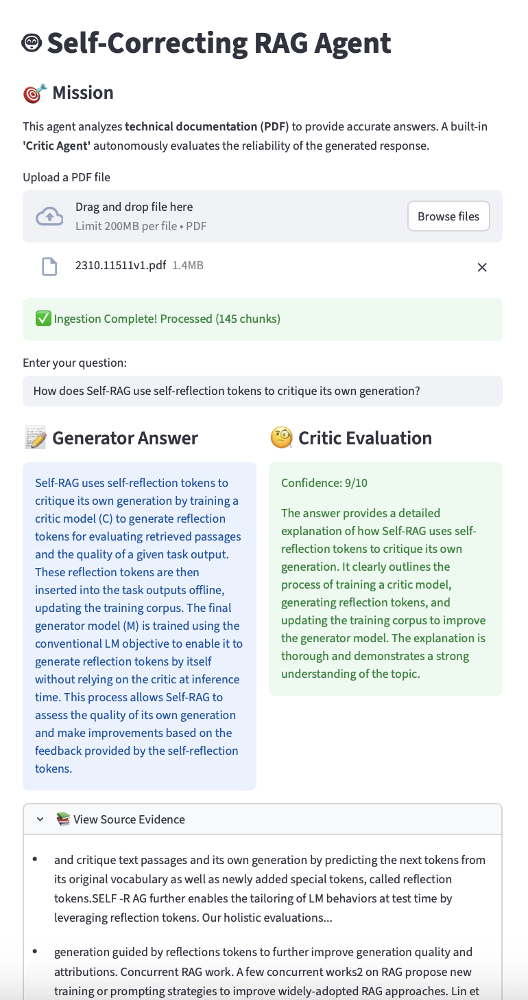

# 🤖 Reliability-Aware RAG Agent


## 📌 Project Overview
**"Minimizing Hallucinations with an Agentic Critic."**

Standard RAG (Retrieval-Augmented Generation) systems often generate plausible but incorrect answers. To address this uncertainty, I implemented a **"Critic-in-the-Loop" architecture**.

This system features a secondary **Critic Agent** that evaluates the generated answer against the retrieved documents and provides a **Confidence Score (1-10)**, ensuring users can gauge the reliability of the information.

## 🚀 Key Features
- **⚖️ Critic Agent:** Acts as a judge to rigorously audit the Generator's response.
- **📊 Confidence Scoring:** Quantifies the reliability of the answer, filtering out low-confidence outputs.
- **📄 PDF Ingestion:** Efficiently processes technical documents using **FAISS** vector search.

## 🖥️ Project Demo
**Scenario:** Analyzing the [Self-RAG] paper.
The **Critic Agent** audits the answer and assigns a **9/10 Confidence Score** based on the evidence.



## 🛠 Tech Stack
- **Framework:** LangChain
- **LLM:** OpenAI GPT-3.5 Turbo
- **Vector DB:** FAISS
- **UI:** Streamlit

## 🚧 Roadmap
- [x] **Phase 1:** Implement Critic Agent & Scoring System 
- [ ] **Phase 2:** Automated Retry Loop for low-confidence scores 
- [ ] **Phase 3:** Integration with complex reasoning agents

## 🏗 Architecture
```mermaid
graph LR
    A[User Query] --> B[Vector Search]
    B --> C[Generator Agent]
    C --> D[Initial Answer]
    D --> E{Critic Agent}
    E --> F[Confidence Score & Feedback]
    F --> G[User Output]